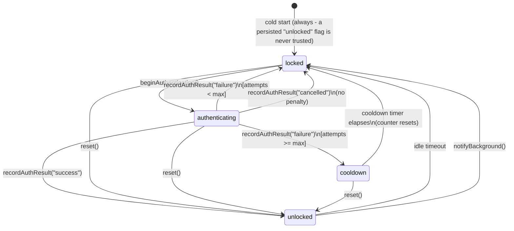

# react-native-biometric-session-guard

A policy and state-machine layer that decides **when** a React Native app
should require biometric re-authentication. It does not show a biometric
prompt itself - it sits on top of whatever you already use for that
(`react-native-keychain`, `expo-local-authentication`, or anything else) and
tells you when to trigger it.

- **Idle timeout** - lock after N minutes of no user interaction.
- **Background re-lock** - lock when the app leaves the foreground, without
  false-triggering on permission dialogs, the keyboard, control center, or an
  incoming call banner.
- **Failed-attempt lockout** - a cooldown after N failed attempts, persisted
  across an app kill so the counter can't be reset by force-quitting.
- **An explicit finite state machine** - `unlocked → locked → authenticating →
unlocked | locked | cooldown`, so every race between the idle timer, the
  background monitor, and an in-flight auth prompt has one documented,
  tested outcome instead of ad hoc booleans.

Zero hard dependencies. The core has no dependency on `react` or
`react-native` at all and runs in plain Jest; the React Native bindings
(`react-native-biometric-session-guard/react-native`) are a separate
subpath so pulling in the core never pulls in RN.

Targets **React Native >=0.83 / React >=19** - the versions where the New
Architecture (Fabric, TurboModules, Bridgeless) is the only architecture RN
ships. This package has no native code of its own, so there's nothing to
migrate: it only calls the JS-level `AppState` API, which behaves the same
under the New Architecture.

## Install

```sh
npm install react-native-biometric-session-guard
```

Bring your own biometric library and your own persistent storage - neither
is a dependency of this package:

```sh
npm install react-native-keychain          # or expo-local-authentication
npm install @react-native-async-storage/async-storage
```

## Quick start

```tsx
import { AppState } from 'react-native';
import AsyncStorage from '@react-native-async-storage/async-storage';
import { createSessionGuard } from 'react-native-biometric-session-guard';
import {
  createReactNativeBackgroundMonitor,
  useBiometricSessionGuard,
} from 'react-native-biometric-session-guard/react-native';

// AsyncStorage's getItem/setItem already match StorageAdapter - no wrapper needed.
export const guard = createSessionGuard({
  idleMinutes: 5,
  lockOnBackground: true,
  maxFailedAttempts: 3,
  cooldownMinutes: 10,
  storageAdapter: AsyncStorage,
});

// Call once, near app startup.
export const stopBackgroundMonitor = createReactNativeBackgroundMonitor(guard, {
  appState: AppState,
});
```

Wire it to a biometric adapter (example: `react-native-keychain`):

```tsx
import * as Keychain from 'react-native-keychain';
import { guard } from './guard';

export async function authenticate(): Promise<void> {
  guard.beginAuthentication();
  try {
    const credentials = await Keychain.getGenericPassword({
      authenticationPrompt: { title: 'Unlock' },
    });
    guard.recordAuthResult(credentials ? 'success' : 'failure');
  } catch (error) {
    // react-native-keychain rejects on user cancellation; inspect error.message
    // for your installed version's cancellation string to map it to 'cancelled'.
    guard.recordAuthResult('failure');
  }
}
```

Or with `expo-local-authentication`:

```tsx
import * as LocalAuthentication from 'expo-local-authentication';
import { guard } from './guard';

export async function authenticate(): Promise<void> {
  guard.beginAuthentication();
  const result = await LocalAuthentication.authenticateAsync({ promptMessage: 'Unlock' });
  if (result.success) {
    guard.recordAuthResult('success');
  } else if (result.error === 'user_cancel' || result.error === 'app_cancel') {
    guard.recordAuthResult('cancelled');
  } else {
    guard.recordAuthResult('failure');
  }
}
```

Render against it:

```tsx
import { useBiometricSessionGuard } from 'react-native-biometric-session-guard/react-native';
import { guard } from './guard';
import { authenticate } from './authenticate';

export function SessionGate({ children }: { children: React.ReactNode }) {
  const state = useBiometricSessionGuard(guard);

  if (state.status === 'unlocked') {
    return children;
  }
  return <LockScreen state={state} onUnlock={authenticate} />;
}
```

Report user activity from wherever your app already tracks it (a root-level
touch handler, a navigation state listener, and so on):

```tsx
<View onTouchStart={() => guard.recordActivity()}>{/* ... */}</View>
```

This package never attaches its own touch or navigation listeners - only
your app knows what counts as "activity."

## The state machine



### Transition table

`—` means the event is a no-op in that state (ignored, not undefined
behavior):

| Event ↓ / State →                 | `unlocked`              | `locked`           | `authenticating`                             | `cooldown`                |
| --------------------------------- | ----------------------- | ------------------ | -------------------------------------------- | ------------------------- |
| `recordActivity()`                | resets idle timer       | —                  | —                                            | —                         |
| idle timeout (internal)           | → `locked` (idle)       | n/a                | n/a                                          | n/a                       |
| `notifyBackground()`              | → `locked` (background) | —                  | —                                            | —                         |
| `beginAuthentication()`           | —                       | → `authenticating` | —                                            | —                         |
| `recordAuthResult('success')`     | —                       | —                  | → `unlocked`, counter reset                  | —                         |
| `recordAuthResult('failure')`     | —                       | —                  | counter++, → `locked` or `cooldown` if ≥ max | —                         |
| `recordAuthResult('cancelled')`   | —                       | —                  | → `locked`, no penalty                       | —                         |
| cooldown timer elapses (internal) | n/a                     | n/a                | n/a                                          | → `locked`, counter reset |
| `reset()`                         | stays `unlocked`        | → `unlocked`       | → `unlocked`                                 | → `unlocked`              |

Every transition is a pure `(state, event) → state` reducer
([src/core/machine.ts](src/core/machine.ts)), so this table is exhaustively
tested per cell in
[src/core/machine.test.ts](src/core/machine.test.ts) - including every `—`.

### The three race conditions this is built to handle

**Idle timer firing while a prompt is already open.** Structurally
impossible: the idle timer only ever runs while `unlocked`, and is torn down
the instant the machine leaves that state. There's no window for it to fire
during `authenticating`.

**The app backgrounding mid-prompt.** `notifyBackground()` is an explicit
no-op while `authenticating` - a background event never second-guesses an
in-flight prompt. Only the eventual `recordAuthResult()` decides what
happens next; if the OS cancelled the native prompt because the app
backgrounded, the host reports `'cancelled'`, which costs nothing.

**Multiple triggers firing near-simultaneously.** Every transition is a pure
reducer. An event with no valid transition from the current state is always
a no-op, never undefined behavior - so two `notifyBackground()` calls back
to back, or an idle timeout and a background event in the same tick, each
resolve deterministically to the same place.

## Background re-lock: why a raw AppState check isn't enough

The naive approach - lock whenever `AppState` reports something other than
`"active"` - produces false re-locks in practice, and the two platforms fail
differently:

- **iOS** reports the transient `"inactive"` state for permission dialogs,
  control center, the notification center, and incoming call banners,
  reserving `"background"` for a genuine backgrounding. A raw state-name
  check would already be _mostly_ fine here.
- **Android** does not make that distinction the same way. React Native's
  own `AppState` documentation states that `"background"` fires for
  "temporary system activities such as autofill credential pickers, even if
  launched by your app or the system" - a real, documented platform-level
  false positive, not an edge case specific to this library.

Because Android can report `"background"` for something that isn't really
backgrounding, a platform-name check can't be the mechanism on either
platform. `createReactNativeBackgroundMonitor` instead debounces on time:
any departure from `"active"` starts a short grace timer (default 500ms,
configurable via `graceMs`). If the app returns to `"active"` before it
fires, the timer is cancelled and the guard is never touched. If it fires
while still away from `"active"`, `guard.notifyBackground()` is called.
Dialog-induced blips resolve within a frame or two, well under the default
window; a genuine app switch or device lock stays away from `"active"`
indefinitely. See
[src/react-native/backgroundMonitor.ts](src/react-native/backgroundMonitor.ts)
and its test file for the exact sequences this is tested against, including
the Android autofill case above.

## Persistence across app kill

The failed-attempt counter is the one piece of state an attacker has a
reason to attack: killing the app resets any in-memory counter. Supply a
`storageAdapter` (anything with an `AsyncStorage`-shaped
`getItem`/`setItem`) and the guard:

- persists `failedAttempts` and, while active, `cooldownUntil` after every
  change;
- on cold start, rejoins an in-progress cooldown with its **remaining**
  duration if the app was killed mid-cooldown - persisting only the counter
  would leave that window open to a kill-during-cooldown bypass;
- auto-recovers and resets the counter if the cooldown fully elapsed while
  the process was dead, exactly as it would have live.

No adapter supplied → an in-memory default is used, with a `console.warn` in
development, since that default silently drops the cross-kill guarantee.
Cold start always starts `locked` regardless: a persisted "the app was
unlocked" flag is never trusted.

## API

### `createSessionGuard(policy)`

```ts
interface SessionGuardPolicy {
  idleMinutes: number;
  lockOnBackground: boolean;
  maxFailedAttempts: number;
  cooldownMinutes: number;
  storageAdapter?: StorageAdapter; // { getItem, setItem }, e.g. AsyncStorage
}
```

The background re-lock grace period is a property of the RN background
monitor, not of the core policy - see `graceMs` on
`createReactNativeBackgroundMonitor` below.

Returns a `SessionGuard`:

| Member                            |                                                                                        |
| --------------------------------- | -------------------------------------------------------------------------------------- |
| `ready: Promise<void>`            | resolves once storage rehydration completes                                            |
| `getState(): GuardState`          | current state, synchronous                                                             |
| `subscribe(listener): () => void` | called on every real transition; returns an unsubscribe function                       |
| `recordActivity()`                | resets the idle timer while `unlocked`; a no-op otherwise                              |
| `beginAuthentication()`           | `locked → authenticating`; call right before showing the native prompt                 |
| `recordAuthResult(outcome)`       | `outcome: 'success' \| 'failure' \| 'cancelled'`                                       |
| `notifyBackground()`              | called by the RN background monitor; you generally won't call this directly            |
| `reset()`                         | forces `unlocked`, clears the failed-attempt counter - e.g. after a fresh login/logout |
| `destroy()`                       | tears down timers and subscribers                                                      |

### `react-native-biometric-session-guard/react-native`

- `useBiometricSessionGuard(guard): GuardState` - subscribes via
  `useSyncExternalStore`.
- `createReactNativeBackgroundMonitor(guard, { appState, graceMs? }): () => void`
  - `appState` takes anything shaped like RN's `AppState` (so it's fakeable
    in tests without installing `react-native`); the returned function
    disposes the monitor.

## Testing

The entire core and the RN bindings are tested in plain Jest with
`jest.useFakeTimers()` and hand-rolled fakes - no native module and no
`react-native` install is required to run the suite. See
[src/core/machine.test.ts](src/core/machine.test.ts) for the full transition
table, [src/core/guard.test.ts](src/core/guard.test.ts) and
[src/core/persistence.test.ts](src/core/persistence.test.ts) for the timer
and cross-kill behavior, and
[src/react-native/backgroundMonitor.test.ts](src/react-native/backgroundMonitor.test.ts)
for the AppState debounce sequences described above.

```sh
npm test
```

## License

MIT © [Shubham Shukla](https://github.com/shubh-shukla)
